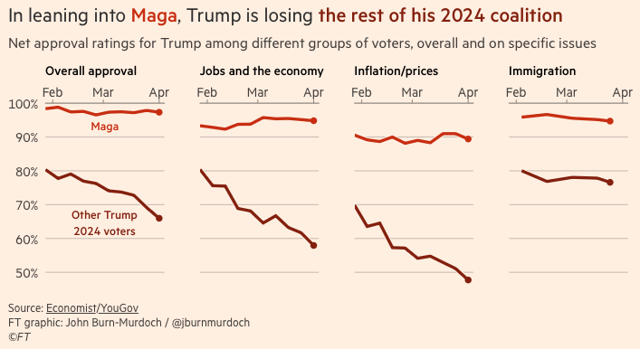
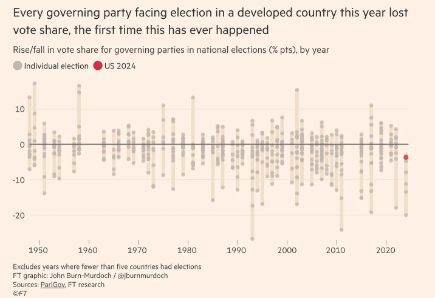

I do not know if anything I have written has ever changed someone's mind. But I do know that things I've read have changed mine, so it seems like persuasion may be possible in at least some circumstances. As I'm starting up blogging again, a natural question on my mind has been if there is any hope of persuading people through online communication. The research here is not very conclusive and is also relatively new. Much of what I read about public opinion in grad school focused on how politicians and media can persuade voters, there was much less research on how voters might persuade each other. 

A new paper in _The Journal of Politics_, "Who's Persuasive? Understanding Citizen-To-Citizen Efforts to Change Minds" by Martin Naunov, Carlos Rueda-Cañòn, and Timothy J. Ryan is an interesting investigation into written persuasion. They performed a study where they had one group of participants write persuasive messages to send to another group. They then measured opinion shift in the recieving group and looked at characteristics of message senders, the messages themselves, and message receivers in order to draw some conclusions about when persuasion happens. 

Instead of a careful (but likely boring) summary of the technical work in the paper, I'm going to draw from their paper but be a bit more speculative, because this is a blog, not an academic journal. I think there are three things to keep in mind about online persuasion. 

1. Try to be persuasive, not popular
2. Some people are more persuadable than others
3. Tell a personal narrative and highlight common ground

### 1. Try to be persuasive, not popular

This probably feels obvious, and the study was set up to incentivize message writers to persuade, but it's important to call out this obvious point because most online discourse is not written to persuade people with opposing political views. An unfortunate dynamic of social media is that the messages that are most popular with people who already agree with you are also the ones that are most likely to reach other people, because they are the most likely to get likes and shares. Those messages are also unlikely to be persuasive, since they often make assumptions about how people understand the world that are shared by the initial audience, but not by the extended audience that does not already agree. Posting is often intended for that core audience and not meant to persuade others. There is no rule (nor should there be) that everything someone posts about politics is meant to be persuasive. 

Being correct about something is also not the same as being persuasive. Strong assertions may be correct, but they're unlikely to be persuasive to people who don't already agree. The suggestion here is not that people seeking to be persuasive should give up on any of their policy positions. If you believe it's the correct thing to do, make the case for it! The suggestion is that _you need to actually make the case_. Assertions of the moral and/or factual correctness of your position are unlikely to be persuasive by themselves. 

### 2. Some people are more persuadable than others

The study by Naunov, Rueda-Cañòn, and Ryan focused on characteristics of persuasive message senders, but they also found that most of the variation in who was persuaded had to do with the characteristics of the message recievers. It's hard to know who will see your message online, but you can still write with an audience in mind, and a natural one to target at this moment is people who voted for Trump in 2024, but might not vote for other Republicans in future elections. 

In elections that are considered landslide elections (1932, 1936, 1964, 1984), the losing candidate still wins 35-40% of the vote. I see liberals despair of persuasion sometimes because they believe the conservative media ecosystem has made modern voters unpersuadable. Trump voters will simply dismiss any facts they don't agree with, so there's no way to reach them. This is likely true for a non-trivial group of voters, but it is not true for all of them. 

Polling from [The Financial Times/YouGov](https://www.ft.com/content/26d15d7e-dd36-4ca1-b974-da8a57bce290) shows that voters who identify as MAGA still approve of Trump, while the *larger group of Trump voters that do not identify as MAGA* are rapidly souring on both the President and his policies, with the exception of immigration policy. 

The last major round of tarriffs imposed by a U.S. president contributed to Herbert Hoover losing about a third of his voters (58% down to 40%), and ushering in an era of Democratic governance. Donald Trump starts with a much narrower margin, having won just under 50% of the popular vote in 2024. There was a [global backlash against all incumbent governments (left, right, or center) in 2024](https://www.wakeuptopolitics.com/p/the-curse-of-the-incumbents-continues). While there are MAGA voters who will stick with Trump no matter what, getting anti-incumbent voters to vote against Republicans (who are now the incumbents) would be enough for Democrats to win large electoral victories.

### 3. Tell a personal narrative and highlight common ground 

The bulk of the study was devoted to characteristics of messages and message senders that were persuasive. The authors tested several hypotheses about what would be persuasive, so I'll divide this section into talking about the ones they found support for and the ones they didn't. Overall, they found that 30% of messages were persuasive, and only 11% backfired. However, when no message at all was sent in a control, there was still movement of 11% in each direction, suggesting the backfire effect may have purely been noisy measurement and not actual backlash to the messages. Being persuasive here refers to a change on a continuous scale, so not a full reversal of opinion. Nonetheless, for a relatively short written message (between 50 and 300 words) to move opinions that often is fairly remarkable. 

#### What works

1. *Perspective Taking*: It makes sense that being able to 'imagine another person's thoughts, feelings, and motivations' increases the chance of being persuasive. If you can understand other people's perspectives you can craft an argument that meets them where they are. This is not an easy thing to do, particularly for an unknown audience, but the study did find that message writers who could do this did succeed in writing more persuasive messages. 
2. *Personal Narrative*: Stories are more engaging and more likely to be accepted by others relative to statistics. Bad news for those of us (like me) who like stats and charts, but this is also a relatively unsurprising finding. Personal stories over cold stats is fundraising 101, so it's not surprising it's also true for political persuasion. 
3. *Highlighting Common Ground*: Starting with an oppositional argument tends to lead to defensive retrenchment and counter-arguments, so it's not surprising to me that highlighting common ground and being respectful of the other person's perspective is likely to be more persuasive. 

The authors also found that message writers with high 'need for cognition' (e.g. people who enjoy activities that require a lot of thinking) were more persuasive. This isn't really a characteristic of persuasive messaging itself, but it makes sense that people who like thinking about things a lot may enjoy the work of trying to write high quality arguments. However, the study also finds that individuals are unable to successfully predict if they will be persuasive.  

#### What doesn't work (or at least lacks evidence)

Not finding evidence that something works is not quite the same as having evidence that it doesn't work - but with that technical caveat aside, it is interesting that the study did not find support for: 

1. *Partisan intensity*: Being indepent or being strongly for your political party
2. *Affective Polarization*: Strong dislike for the other political party
3. *Political Interest*: Level of interest in politics
4. *Political Knowledge*: Knowledge of politics
5. *Mentioning Specific Facts*: Messages that reference specific facts
6. *High Self-Esteem*: Writers with higher self-esteem
7. *Extreme Issue Attitudes*: Writers with extreme issue attitudes were neither more or less persuasive than others

While I'm a bit sad that political knowledge and specific facts don't appear to be persuasive, I don't find it surprising. I admit I would have expected strongly partisan messages or extreme issue attitudes to be less persuasive, though perhaps that's because I would have expected them to be less likely to do things like perspective taking and highlighting common ground that did turn out to be effective techniques. Since the study already accounts for those types of message characteristics, perhaps it's slighly less surprising there's no additional effect from strong partisanship. 

### Go forth and persuade!

Not all online communication should be aimed at persuading people who disagree, but some of it is, and I think it's worthwhile to at least occassionally pause and try to figure out what works. I am not always good at taking the advice I'm giving here, some of which is very disheartening for politics nerds like me who love facts and figures. I've also never been good at sharing personal narratives, not only because I find it a bit uncomfortable, but also because I rarely have relevant personal narratives to share. Nonetheless, I do want to be persuasive in my writing, so while I'm not going to stop sharing charts and graphs, I will try to take in at least some of my own advice and find cases where I can use common ground and personal narratives to engage in meaningful discussion and maybe, just maybe, actually persuade someone to change their mind. 